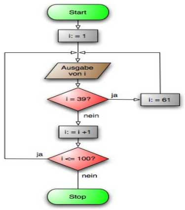

## Programm-Ablaufplan (PAP)
> [PAP auf Wikipedia](https://de.wikipedia.org/wiki/Programmablaufplan)

## Nassi-Shneiderman-Diagramm (Struktogramm)
> [NSD auf Wikipedia](https://de.wikipedia.org/wiki/Nassi-Shneiderman-Diagramm)

