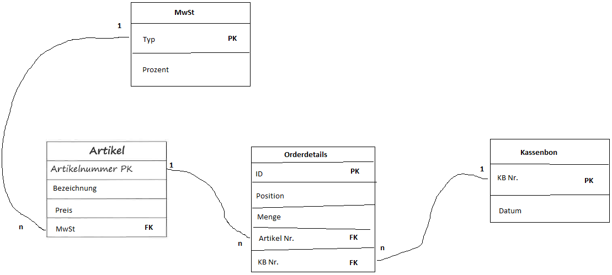

## Entity-Relationship-Modell
> [ERM auf Wikipedia](https://de.wikipedia.org/wiki/Entity-Relationship-Modell)


## Normalisierung
> [Normalisierung auf Wikipedia](https://de.wikipedia.org/wiki/Normalisierung_(Datenbank))


## relationales Datenbankmodell
> [Link 1](https://tinohempel.de/info/info/datenbank/erm2codd.htm)  
> [Link 2](http://www.inf-schule.de/information/datenbanksysteme/ermodelle/datenmodell)



## Test DB
```sql
DROP TABLE cities CASCADE;

DROP TABLE products CASCADE;

DROP TABLE orders CASCADE;

DROP TABLE orderdetails CASCADE;

DROP TABLE customers CASCADE;

COMMIT;

CREATE TABLE cities 
(
  PLZ   INTEGER PRIMARY KEY,
  Ort   VARCHAR(60) NOT NULL
);

CREATE TABLE products 
(
  ID      SERIAL PRIMARY KEY,
  Name    VARCHAR(60) NOT NULL,
  Preis   FLOAT NOT NULL
);

CREATE TABLE orderdetails 
(
  ID           SERIAL PRIMARY KEY,
  Anzahl       INTEGER NOT NULL,
  produkt_id   INTEGER REFERENCES products
);

CREATE TABLE customers 
(
  ID           SERIAL PRIMARY KEY,
  Anrede       VARCHAR(20) NOT NULL,
  Vorname      VARCHAR(40) NOT NULL,
  Nachname     VARCHAR(40) NOT NULL,
  Strasse      VARCHAR(40) NOT NULL,
  Hausnummer   VARCHAR(10) NOT NULL,
  PLZ          INTEGER REFERENCES cities,
  Vorwahl      INTEGER,
  Telefon      INTEGER
);

CREATE TABLE orders 
(
  customer_id   INTEGER REFERENCES customers,
  order_id      INTEGER REFERENCES orderdetails,
  datum         DATE NOT NULL,
  PRIMARY KEY (customer_id,order_id)
);

COMMIT;

INSERT INTO cities
(
  PLZ,
  Ort
)
VALUES
(
  12345,
  'Köln'
),
(
  12335,
  'Köln'
);

INSERT INTO products
(
  ID,
  Name,
  Preis
)
VALUES
(
  DEFAULT,
  'Apfel',
  0.5
),
(
  DEFAULT,
  'Banane',
  0.6
),
(
  DEFAULT,
  'Milch',
  0.79
);

INSERT INTO orderdetails
(
  ID,
  Anzahl,
  produkt_id
)
VALUES
(
  DEFAULT,
  10,
  1
),
(
  DEFAULT,
  4,
  2
),
(
  DEFAULT,
  1,
  3
);

INSERT INTO customers
(
  ID,
  Anrede,
  Vorname,
  Nachname,
  Strasse,
  Hausnummer,
  PLZ,
  Vorwahl,
  Telefon
)
VALUES
(
  DEFAULT,
  'Frau',
  'Ella',
  'Schmitz',
  'Ringgasse',
  '1',
  12345,
  0221,
  436257
),
(
  DEFAULT,
  'Herr',
  'Peter',
  'Schulze',
  'Domstraße',
  '22',
  12335,
  0221,
  256999
);

INSERT INTO orders
(
  customer_id,
  order_id,
  datum
)
VALUES
(
  1,
  1,
  '2016-09-01'
);

COMMIT;


```