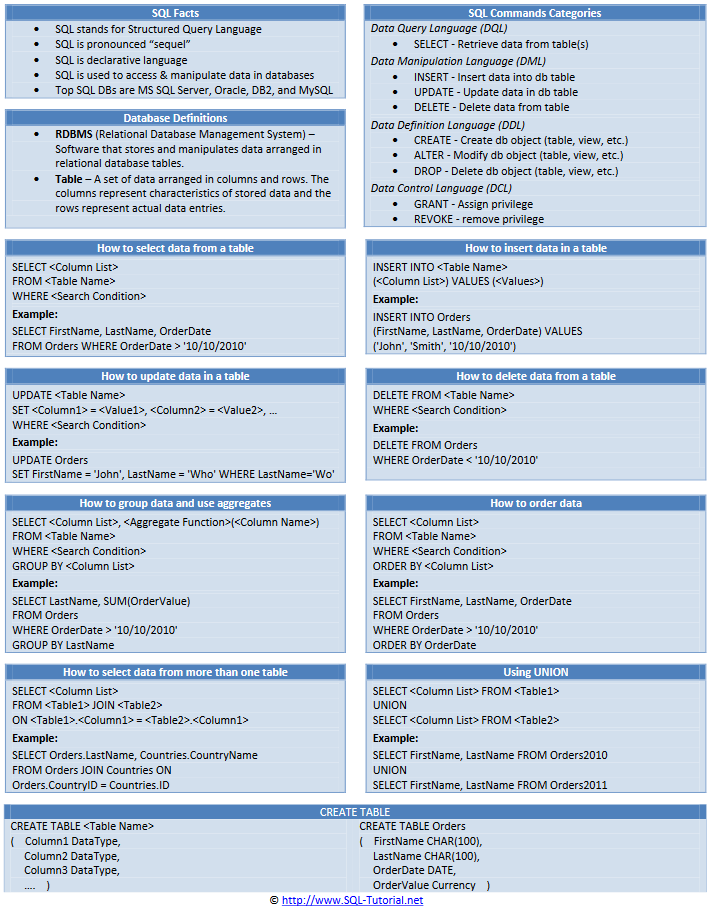

## Intro SQL
> **cheat sheets**  
> - [01](http://www.cheat-sheets.org/sites/sql.su/)
> - [02](https://zeroturnaround.com/rebellabs/sql-cheat-sheet/)
> - [03](https://www.w3schools.com/sql/sql_quickref.asp)



```sql
-- equi join (ignore this construct if using JOIN)
SELECT
  o.orderid,
  o.orderdate,
  c.companyname
FROM
  orders AS o, customers AS c
WHERE
  o.customerid = c.customerid;
```

## Data Manipulation Language (DML)
> [DML auf Wikipedia](https://de.wikipedia.org/wiki/Data_Manipulation_Language)  
> add, modify, delete data
- truncate
- update
- insert
- delete

## Data Query Language (DQL)
> retrieve information
- select
- show
- help

## Data Definition Language (DDL)
> [DDL auf Wikipedia](https://en.wikipedia.org/wiki/Data_definition_language)  
> add, modify, delete the logical structures which contain the data or user access - DDL is about 'metadata'
- create
- alter
- drop