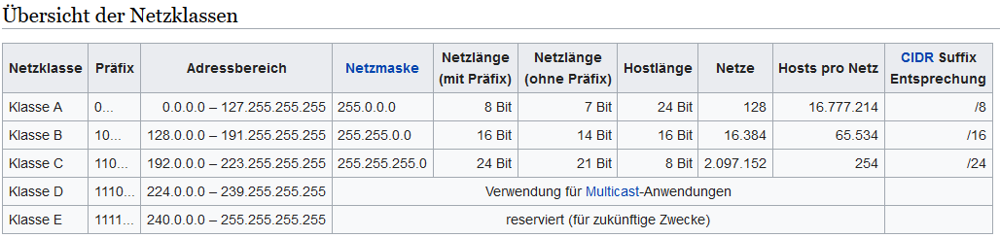
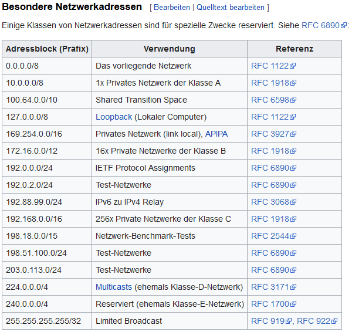
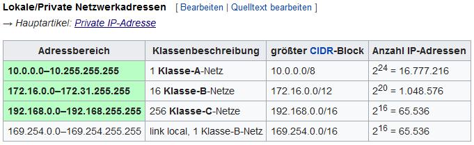

## IPv4
> [IPv4 auf Wikipedia](https://de.wikipedia.org/wiki/IPv4)  
> [Netzklasse auf Wikipedia](https://de.wikipedia.org/wiki/Netzklasse)  
> [Private IPs auf Wikipedia](https://de.wikipedia.org/wiki/Private_IP-Adresse)  
> [Subnetz auf Wikipedia](https://de.wikipedia.org/wiki/Subnetz)  
> [Netzmaske auf Wikipedia](https://de.wikipedia.org/wiki/Netzmaske)

  
  
  
